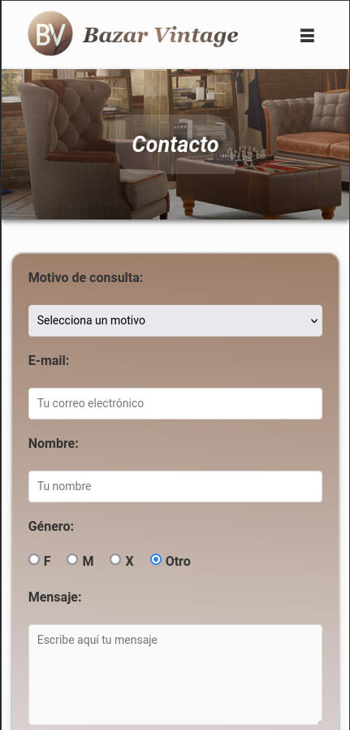
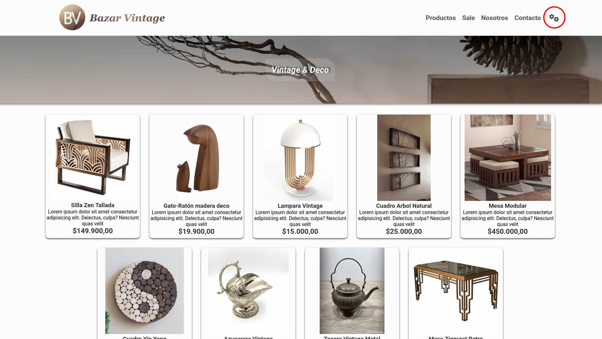
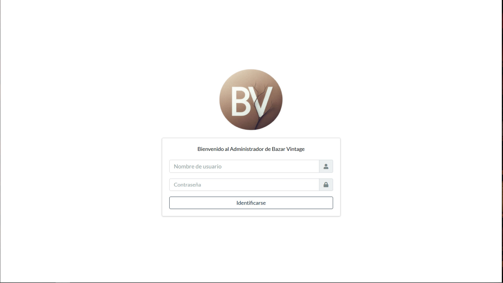
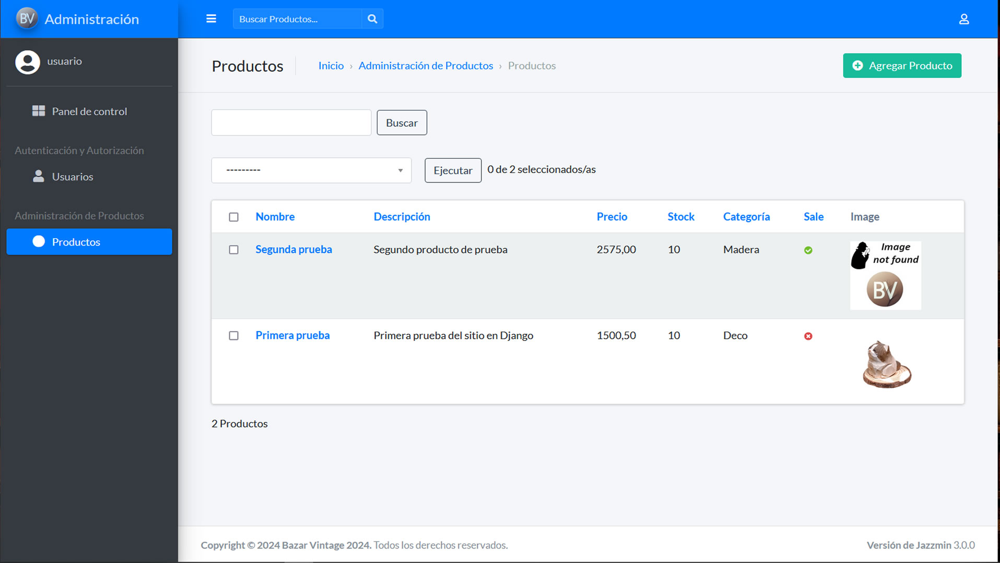
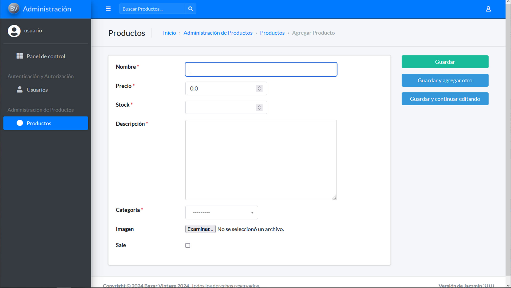
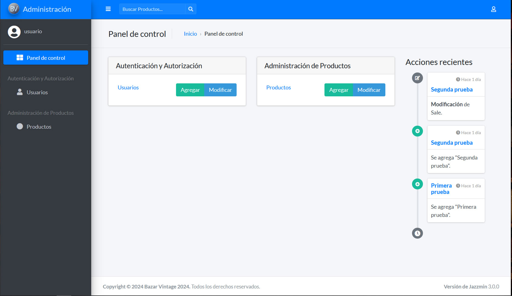
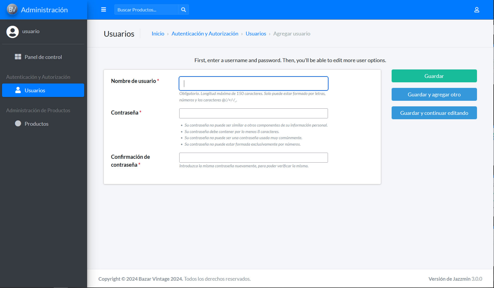
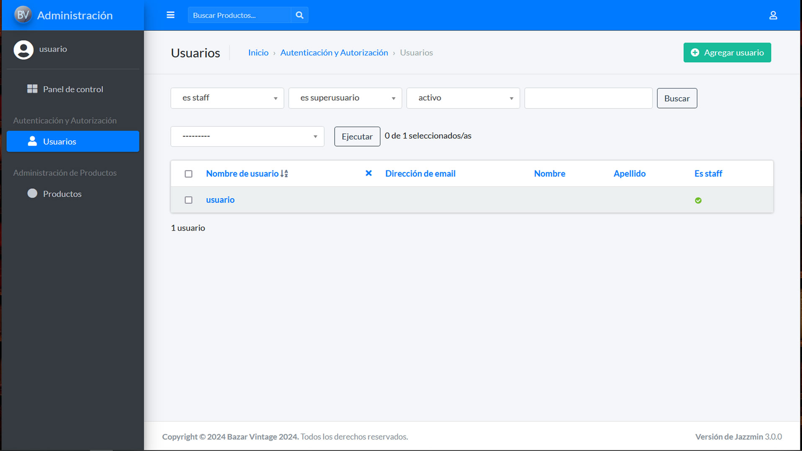
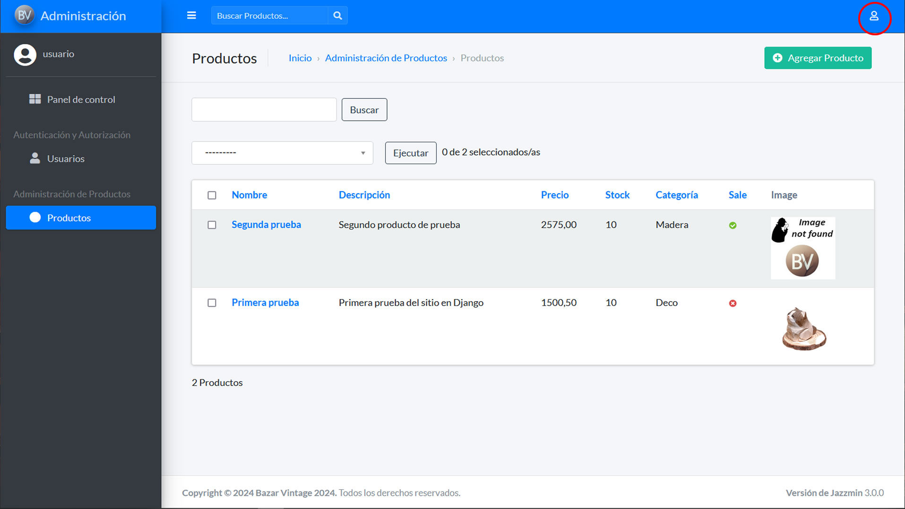
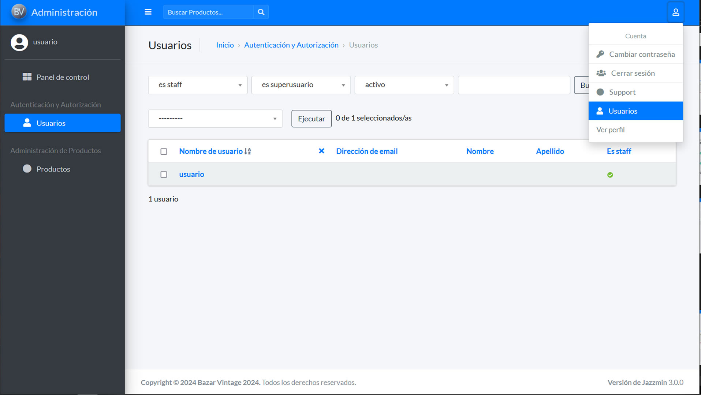

# Bazar Vintage

Bienvenido al repositorio del proyecto ***Bazar Vintage***. Este sitio web muestra una colección única de productos de decoración y bazar vintage o antiguo. Nuestro objetivo es ofrecer una experiencia única a los amantes del estilo vintage, proporcionando una cuidadosa selección de artículos que agreguen un toque de nostalgia y estilo a cualquier hogar.

## Capturas de pantalla:

### Desktop

  

### Mobile

## Backend

Mediante el ícono indicado por el círculo rojo podrá tener acceso como administrador y hacer uso de las funcionalidades CRUD de ***Bazar Vintage***.

Lo primero que debe de hacer para poder usar las funcionalidades administrativas es identificarse con su nombre de usuario y contraseña.

Una vez realizada esa primera operación tendrá acceso a la página que muestra los productos ingresados anteriormente, en el caso que existan. En panel izquierdo se indica en azul que Ud. se encuentra en la administración de productos.
Con el botón verde ubicado en el ánculo superior derecho, podrá ingresar un nuevo producto.

Esta es la pantalla que le permitirá agregar un nuevo producto. En ella, los campos indicados con un asterisco rojo son obligatorios. Si Ud. no los ingresa el sistema se los pedirá.
El checkbox ***Sale*** es para indicar que el producto está en promoción. Esto puede cambiarlo en cualquier momento.
La imagen no es obligatoria. En el caso de que no selecciones una imagen, el sistema por defecto le asignará la siguiente imagen.

Esta pantalla, según se indica en azul en el panel izquierdo, corresponde al panel de control. Desde aquí puede agregar o modificar tanto usuarios como productos.
La pantalla de gestión de productos ya fue descripta anteriormente en este documento.
La pantalla para agregar un usuario es la siguiente:

En esta pantalla también se indican con un asterisco rojo los campos oblitarios.
Además se dan las instrucciones necesarias para una contraseña robusta.

Cómo se indica en azul en el panel de la izquierda esta es la sección de gestión de usuarios. Tanto en esta pantalla como en la des gestión de productos si selecciona un item (usuario o producto según corresponda) y luego hace click sobre el accede a la edición del item.

Se muestra nuevamente la sección de productos con el fin de destacar la coherencia y similitud de operación que resulta transversal a todo el sistema.
Además observe lo que se describió anteriormente sobre el campo ***Sale***.

Finalmente en el ícono ubicado en la esquina superior derecha Ud. puede acceder a la gestión de su propia cuenta.

## Características principales:

- **Explora una Colección Única:** Descubre una amplia variedad de productos cuidadosamente seleccionados, desde muebles hasta accesorios decorativos, todos con un encanto vintage inigualable.

- **Diseño Intuitivo:** Navega por nuestro sitio de forma fácil y sencilla gracias a un diseño intuitivo y una interfaz de usuario amigable.

- **Contacto:** Contamos con un formulario para consultas sencillo de usar.

## Recursos y Herramientas

- El proyecto se realizó con el framework ***[Django](https://www.djangoproject.com/)***.
- La maquetación se realizó con sobre HTML 5 con CSS **FlexBox**.
- El sitio cuenta con 5 páginas totalmente responsive (Desktop, Tablet, Mobile)
  - Home, Products, Sale, Contact y About
- El formulario de contacto incluye la posibilidad de cargar una imágen en formato jpg o png y se valida por JavaScript.
- Se utilizan transiciones y animaciones de distitnto tipo en botones, cards, nav y footer.
- El logo fue realizado por la AI ***[DALL-E 3](https://openai.com/index/dall-e-3/)***.
- Se agregó un Favicon a todas las páginas del proyecto.
- Se usa ***[Django Jazzmin](https://django-jazzmin.readthedocs.io/)*** para estilizar el Admin con personalizaciones para su mejor uso.
- Se agrega la visualización de imágenes en la lista de productos en admin.
- Se utilizaron íconos de ***[FontAwesome](https://fontawesome.com/)*** y fuentes de ***[Google Fonts](https://fonts.google.com/)***.
- Se agregan ***[Actions](https://docs.djangoproject.com/en/5.0/ref/contrib/admin/actions/)*** para aplicar  o quitar la propiedad de **Sale** forma másiva a productos.

## Contribuciones:

Si deseas proponer cambios nos encantaría recibir tus contribuciones para mejorar y hacer crecer este proyecto. Si tienes alguna idea, sugerencia o corrección, no dudes en enviar un pull request.

¡Gracias por pasar!
